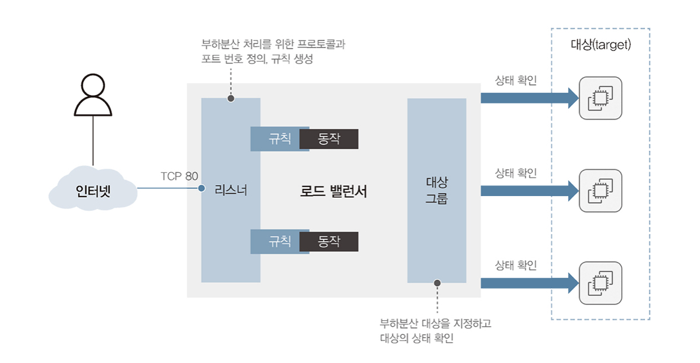

### 부하 분산이란?

- 흔히 **로드 밸런싱**이라고 많이 말한다.
- 로드 밸런싱을 수행하는 게 **로드 밸런서**
- **로드 밸런싱**은 서버가 클라이언트 요청을 받아 처리하는 과정에서 발생하는 부하에(연산) 대해 동일한 목적을 수행하는 다수의 서버에 분산하여 처리하는 기능

> **고가용성**: 시스템이나 서비스가 지속적으로 작동 가능하도록 하는 기능
>
> **내결함성**: 시스템의 일부 구성 요소가 작동하지 않더라도 계속 작동할 수 있는 기능

### Amazon ELB의 기능

- **ELB**(Elastic Load Balancing)는 AWS의 로드 밸런싱 기술
- **ELB는** EC2 인스턴스에서 운영 중인 애플리케이션, 마이크로서비스 또는 컨테이너 서비스로 유입되는 **트래픽을 자동 분산 처리하는 기술**

![[IMG_563E2D09372C-1.jpeg]]

- 위 그림처럼 클라이언트에서 인스턴스로 바로 가는 게 아니라 ELB를 한 번 거쳐서 여러 서버로 로드 밸런싱하여 전달
- 오토 스케일링 기능과 결합하여 확장성 있게 인스턴스를 추가하거나 제거하면서 가용성 유지

### Amazon ELB 구성 요소

**로드 밸런서 구성 요소**

1. **로드 밸런서**
    - 여러 대의 EC2 인스턴스, IP 주소, 람다 등을 사용하여 트래픽을 대상 그룹에 있는 인스턴스로 분산시켜 애플리케이션의 가용성을 유지하는 역할

2. **대상 그룹**
    - 로드 밸런서에서 분산할 대상의 집합을 정의하는 역할
    - 대상 그룹의 인스턴스에 대해서 정적 또는 동적으로 구성 가능하며 라우팅 규칙에 따라서 요청을 받아들일 대상 그룹을 선택함
    - **로드 밸런서는** 대상 그룹에 포함된 대상들의 상태를 주기적으로 확인해서 **장애 발생 대상을 자동으로 제외하여 요청을 전달**함

3. **리스너**
    - 로드 밸런서에서 사용할 포트와 프로토콜을 설정하는 역할
    - 로드 밸런서로 들어온 **요청을 처리할 대상 그룹을 선택**하는 역할
    - 즉 리스너는 로드 밸런서에 연결된 프로토콜과 포트로 클라이언트의 요청을 수신하고, 해당 요청을 대상 그룹으로 라우팅

### Amazon ELB 동작 방식

1. **클라이언트 요청 수신**: 로드 밸런서에서 클라이언트의 요청을 수신하고, 로드 밸런서는 클라이언트와 연결을 유지하며 요청을 수신하려고 리스너를 등록함
2. **대상 그룹 선택**: 수신한 클라이언트의 요청을 처리할 대상 그룹을 선택함. 여기서 대상 그룹은 인스턴스, IP 주소, 람다 함수, ALB 등등 여러 유형으로 구성
3. **트래픽 분산**: 선택된 대상 그룹에서 처리할 대상을 선택하여 그 대상으로 요청을 분산함, 이때 로드 밸런서는 각 대상의 가용성 상태를 모니터링하고, 가용 불가능하면 그 대상은 제외
4. **응답 반환**: 분산된 요청을 **대상에서 처리**하고 클라이언트에 응답을 반환. 이때 이 응답이 **로드밸런서에서 수신한 것으로 반환**

**ELB 생성시 로드밸런서와 통신하는 방식 2가지**

1. **인터넷 경계 로드 밸런서**: **외부**에서 직접 로드 밸런서에 접근하는 방식
2. **내부 로드 밸런서**: 외부의 접근이 차단된 **격리 네트워크(내부 서버 전용)** 에서 로드 밸런서를 사용하는 방식

### Amazon ELB 교차 영역 로드밸런싱

- **교차 영역 로드 밸런싱**: 여러 가용 영역에서 배포된 EC2 인스턴스 간에 트래픽을 균등하게 분산하는 기능
- 기본적으로 ELB는 트래픽을 각 가용 영역 내에 있는 대상으로만 트래픽을 분산한다. 이는 대상 그룹의 가용성을 높이지만 가용 영역 내에 인스턴스 수량이 불균형이라면 문제가 발생한다.
- `그림 4-5, 4-6 보기

### Amazon ELB 종류

- CLB, ALB, NLB, GWLB로 나눠짐
- **CLB**
    - Classic Load Balancer 이름에서부터 알 수 있듯 초기 로드 밸런서
    - 4계층과 7계층 프로토콜 모두 지원
    - 서버 기본 주소 변경시 로드 밸런서를 새로 생성해야 함
    - NLB나 ALB 같은 새로운 로드 밸런서가 대체
- **ALB**
    - Application Load Balancer **L7 로드 밸런서**
    - **HTTP/HTTPS** 프로토콜 지원
    - 대상 그룹 단위로 트래픽 분산
    - 각 대상 그룹은 ALB 요청을 전달할 EC2 등으로 라우팅하는 기능 제공
    - HTTP 헤더를 확인해서 라우팅 기능 제공
    - 경로 기반 라우팅: URL 경로를 기반으로 요청 분산
    - 이 경로 기반 라우팅이라는 게 `/api/*` 요청은 A 서버로, `/static/*` 요청은 B 서버로 가게끔 하는 거임
    - 호스트 기반 라우팅: 호스트 이름을 기반으로 요청 분산
    - 쿼리 문자열 기반 라우팅: URL 쿼리 문자열 기반으로 요청을 분산
    - 오토 스케이링 지원
    - 대상 그룹 내 인스턴스에 대해 상태 검사를 수행하고, 문제 발생시 자동 장애 조치
    - Amazon CloudWatch Log 기능과 통합하여 모니터링 분석 가능
- **NLB**
    - Network Load Balancer는 **L4 로드 밸런서**
    - **TCP, UDP, TLS** 프로토콜 지원
    - 클라이언트와 로드 밸런서 간 연결을 TCP 레벨에서 유지 (대규모 트래픽 처리 가능)
    - 처리량이 좋음
    - 빠른 응답 시간
    - 높은 가용성
    - IP 주소 보존
    - 모니터링 기능 제공
    - 게임 서버, 미디어 스트리밍 등에서 사용
- **GWLB**
    - GateWay Load Balancer 네트워크 트래픽을 서드 파티 방화벽 어플라이언스 장비로 처리하는 로드 밸런서
    - 요청에 따라서 트래픽을 확장하거나 축소하면서 서드 파티 장비들로 분산 처리

![[IMG_2041.jpg]]

### CloudFormation

- IaC (Infrastructure as Code) 기반으로 AWS 인프라 리소스를 자동 생성하는 서비스

> **IaC**: 선언된 코드로 자원을 생성하는 것, 장점으로는 불필요한 오류 감소와 인프라 생성시 동일한 템플릿이라면 다른 환경에서도 쉽게 생성 가능

- CloudFormation을 사용하면 VPC, EC2 등 리소스를 수동 생성하지 않아도 되고, 코드로 구성하고 스택을 생성해서 서비스의 프로비저닝과 설정을 미리 구성 가능

> **프로비저닝**: 자원을 준비하고 설정해서 사용 가능하도록 만드는 과정, 즉 자원 관리를 자동화할 수 있는 과정

**CloudFormation 구성 요소**

1. **템플릿**: AWS 인프라를 JSON이나 YAML 형태 코드로 정의하는 파일
2. **스택**: CloudFormation을 이용해서 생성하는 AWS 인프라의 집합
3. **리소스**: CloudFormation이 생성하는 AWS 리소스 (EC2, RDS, S3 등)
4. **파라미터**: 스택을 생성할 때 전달하는 매개변수
5. **이벤트**: CloudFormation 스택에서 발생하는 모든 행위에 대한 기록

**CloudFormation 동작 순서**

1. **CloudFormation 템플릿 작성**: 관리하고자 하는 인프라를 정의하는 템플릿 작성
2. **템플릿 업로드**: 작성한 템플릿을 AWS CloudFormation에 업로드
3. **스택 생성 또는 업데이트**: 업로드한 템플릿으로 스택을 생성하거나 업데이트
4. **스택 모니터링**: CloudFormation은 스택이 생성되면서 로그와 이벤트를 생성하는데 이것으로 모니터링
5. **스택 삭제**: CloudFormation에서 스택 삭제시 해당 스택에 속한 AWS 인프라도 모두 삭제됨

#### SNMP

- 네트워크 장비들을 모니터링하고 관리하는 프로토콜
- SNMP는 네트워크 장비들에 에이전트를 설치하고 SNMP 관리자와 에이전트 간에 메세지를 주고받는 형식으로 동작
- SNMP는 MIB라는 데이터베이스를 사용해서 네트워크 장비의 상태 정보를 저장하는데 이를 OID라고 칭함
- 이 정보는 SNMP 관리자가 해당 ID를 요구할 때마다 에이전트가 그에 맞는 자원 정보를 전달하는 방식
- SNMP는 네트워크 장비들의 **성능 모니터링, 구성 변경, 장애 진단** 등 다양한 용도에서 사용
- SNMP는 **UDP 프로토콜을 사용하고, 161번 포트를 사용**함